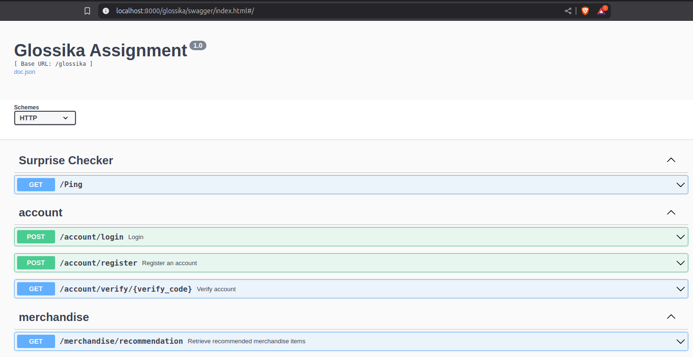

# Glossika Backend Assignment
Develop APIs for registering, verifying, login and mock the get recommendation for assignment.



## Prerequisites
- Docker: Version 20.10+
- Docker Compose: Version 2.20+

## Running with Docker
1. Clone the repository and navigate to the project directory:
    ```
    git clone https://github.com/wwieo/glossika_assignment.git
    ```
2. Build
   ```
   make docker-build
   ```
3. Start
   ```
   make docker-up
   ```
4. Then you can open the local Swagger interface to explore the API.
   ```
   http://localhost:8000/glossika/swagger/index.html
   ```
